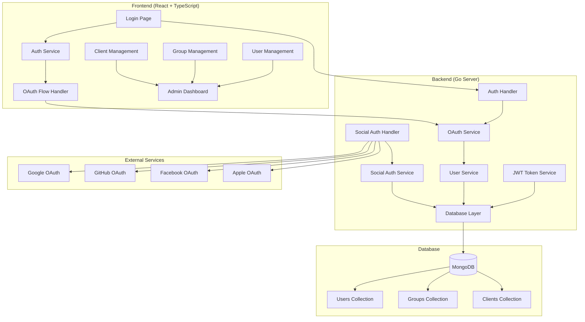
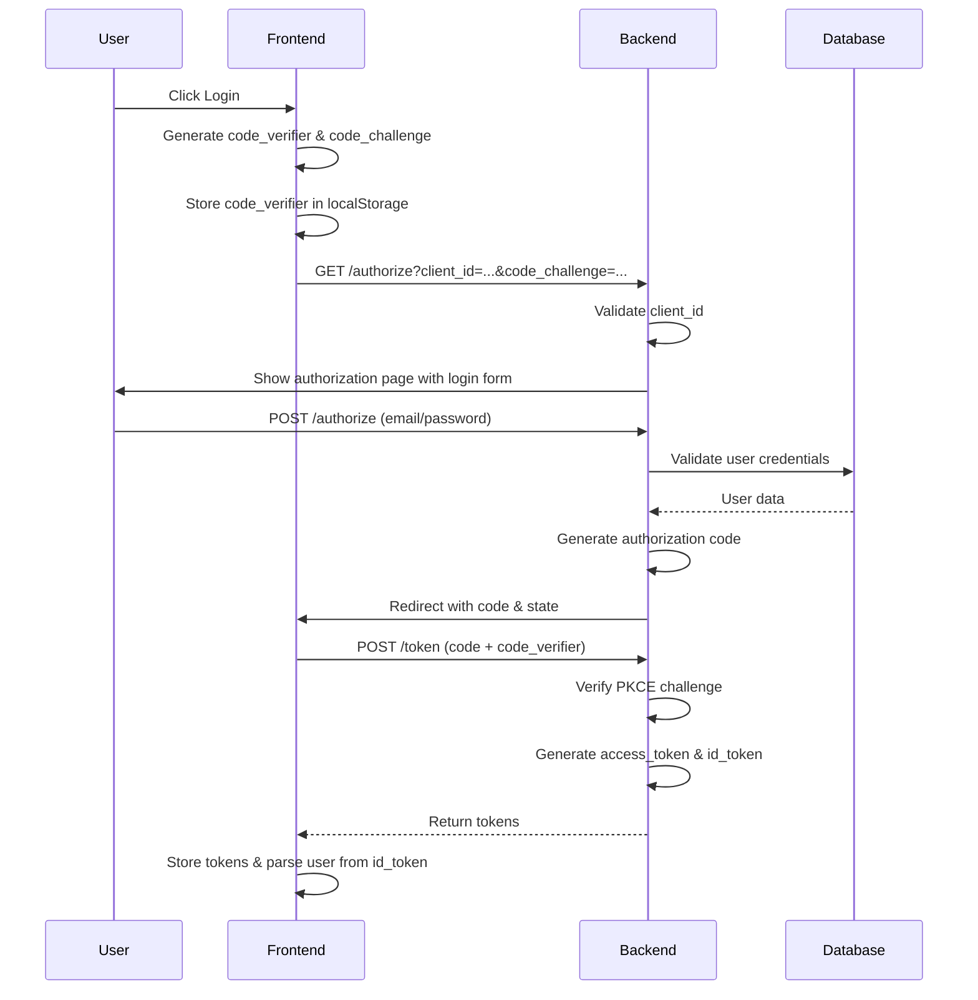
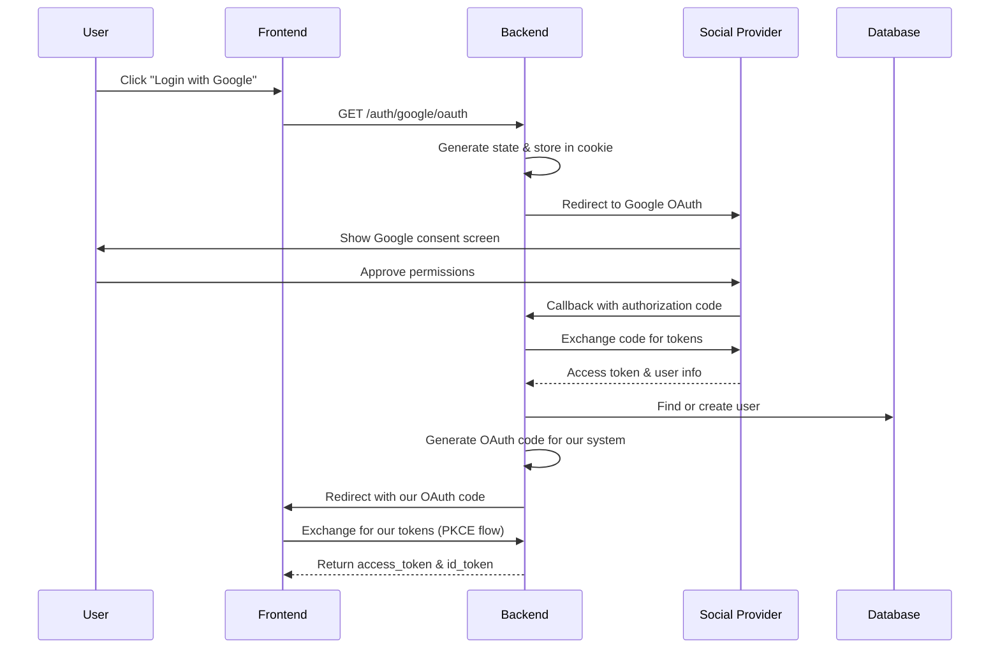
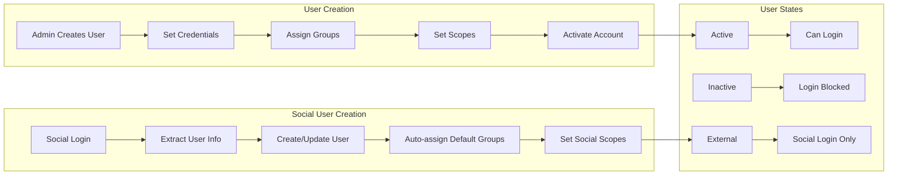
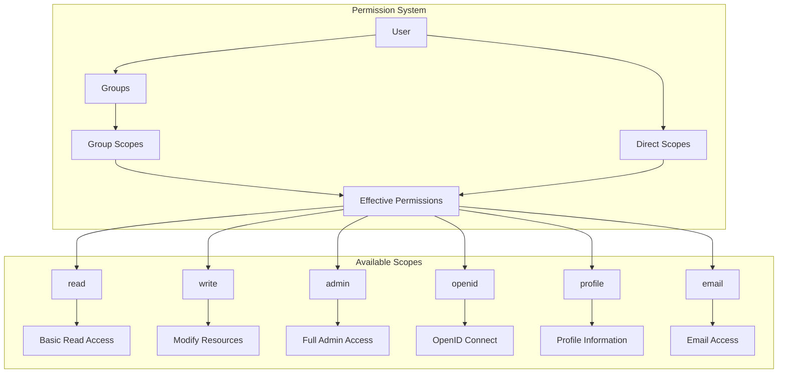
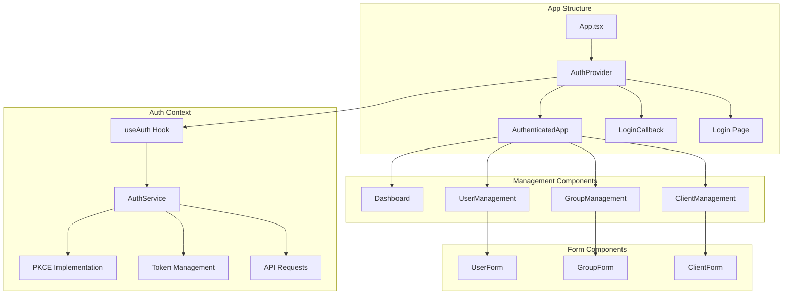
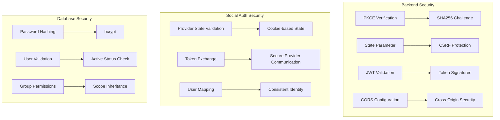
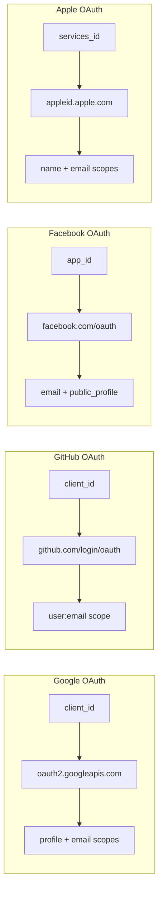

# OAuth2 + PKCE + OpenID Connect + Social Login Architecture

## System Overview


## Authentication Flow

### 1. OAuth2 Authorization Code Flow with PKCE


### 2. Social Login Flow


## User Management System

### 3. User Lifecycle Management


### 4. Permission & Group Management


## Frontend Architecture

### 5. React Component Structure


### 6. State Management & Security
```mermaid
graph LR
    subgraph "Frontend Security"
        A[localStorage] --> B[Encrypted Tokens]
        B --> C[Token Expiry Check]
        C --> D[Auto Logout]
        E[PKCE Code Verifier] --> F[SHA256 Challenge]
        F --> G[Secure Code Exchange]
    end

    subgraph "State Safety"
        H[Null Safety Patterns] --> I[safeUsers = users || []]
        I --> J[Prevent Runtime Errors]
        K[Loading States] --> L[Spinner Components]
        M[Error Handling] --> N[Toast Notifications]
    end
```

## Key Security Features

### 7. Security Implementation


## Supported Social Providers

### 8. Social Login Configuration


## API Endpoints

### 9. Backend API Structure
```mermaid
graph TB
    subgraph "Auth Endpoints"
        A[GET /authorize] --> B[Authorization Page]
        C[POST /authorize] --> D[Generate Auth Code]
        E[POST /token] --> F[Exchange for Tokens]
        G[POST /login] --> H[Direct Login]
    end

    subgraph "Social Auth Endpoints"
        I[GET /auth/{provider}/oauth] --> J[Provider Redirect]
        K[GET /auth/{provider}/callback] --> L[Handle Provider Response]
    end

    subgraph "Management Endpoints"
        M[GET /api/users] --> N[List Users]
        O[POST /api/users] --> P[Create User]
        Q[GET /api/groups] --> R[List Groups]
        S[GET /api/clients] --> T[List OAuth Clients]
    end

    subgraph "Dashboard Endpoints"
        U[GET /api/dashboard/stats] --> V[System Statistics]
        W[GET /api/dashboard/activity] --> X[Recent Activity]
    end
```

This comprehensive architecture supports:
- **OAuth2 Authorization Code Flow with PKCE** for secure authentication
- **Social login federation** with Google, GitHub, Facebook, and Apple
- **OpenID Connect** with ID tokens containing user information
- **Comprehensive user management** with groups, scopes, and permissions
- **Modern React frontend** with TypeScript and null safety
- **Production-ready security** with proper token handling and validation